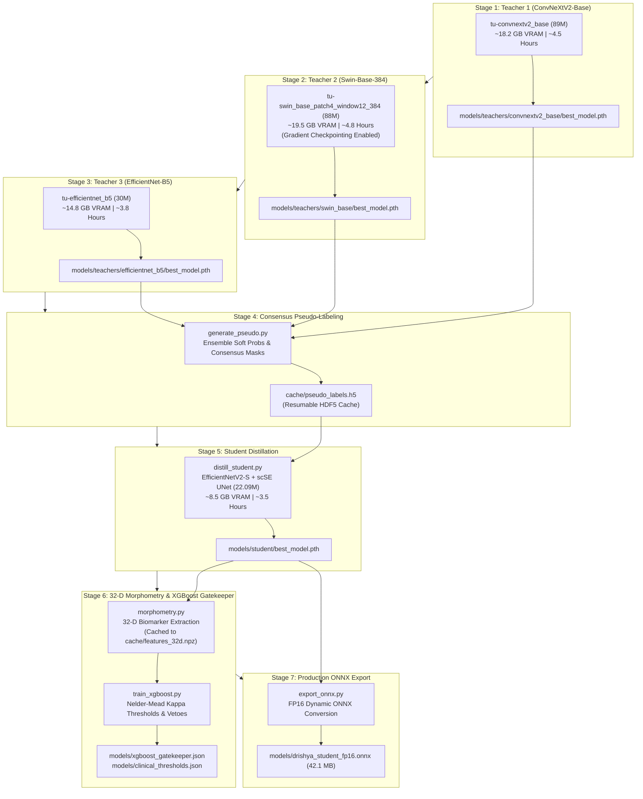

# DRISHYA: SOTA Training Specification & Execution Blueprint (24 GB RTX 6000 Foundry)

- **Document Version**: 3.3.0 (Production Master)
- **Target Hardware**: 1× NVIDIA Quadro RTX 6000 (24 GB GDDR6 VRAM, Turing TU102 Architecture)
- **Execution Target**: 100% Interruptionless, Fault-Tolerant, Resumable Multi-Stage SOTA Training Pipeline
- **Project Root**: `/home/aman/PROJECTS/drishya`
- **Problem Statement**: SIH26038 — Explainable AI for Diabetic Retinopathy Screening in Rural India (MathWorks)
- **Target Metrics**: Quadratic Weighted Kappa (QWK) $\ge 0.915$, Exact Accuracy $\ge 88.0\%$, Referral Sensitivity (Grade $\ge 2$) $\ge 96.5\%$, Specificity $\ge 91.0\%$

---

## 1. Executive Summary & Hardware Calibration

This implementation blueprint provides a complete execution strategy for training DRISHYA's dual-engine neuro-symbolic diagnostic pipeline on a **single 24 GB NVIDIA Quadro RTX 6000 GPU**. With all datasets acquired and preprocessed, the training pipeline runs autonomously through 7 sequential stages with built-in fault tolerance and bitwise resumption.

### Hardware Calibration: Turing TU102 (RTX 6000) vs. Modern Clusters

| Dimension | 128 GB Server Cluster Spec | 24 GB Quadro RTX 6000 Spec | Operational Adaptation |
| :--- | :--- | :--- | :--- |
| **GPU VRAM** | 128 GB (Multi-A100) | 1× Quadro RTX 6000 (24 GB GDDR6) | Sequential training; Physical Batch Size 8 + Gradient Accumulation 2 (Effective Batch 16). |
| **Arithmetic Precision** | BF16 / FP16 Mixed | Turing TU102 (Compute Capability 7.5) | Strictly use FP16 Mixed Precision with `torch.cuda.amp.GradScaler` (Turing lacks hardware BF16). |
| **Execution Concurrency**| 3 Teachers in Parallel | 1 GPU (24 GB) | Sequential execution: Teacher 1 $\to$ Teacher 2 $\to$ Teacher 3 $\to$ Distillation. |
| **Host Memory** | 128 GB RAM | 47 GB RAM (10 GB `/dev/shm`) | Set DataLoader `num_workers = 8`, `pin_memory = True`, `persistent_workers = True`. |
| **Input Channels** | Standard RGB / Greyscale | 3-Channel Synthetic Composite | Channel 0: Green CLAHE; Channel 1: Ben Graham Gaussian; Channel 2: Morphological Black-Hat. |

---

## 2. End-to-End Pipeline Architecture



---

## 3. Seven-Layer Resilience & Resumability Architecture

The training framework implemented in `training/` includes 7 layers of defense to ensure zero data loss during power outages, SSH disconnections, or out-of-memory events:

| Layer | Mechanism | Implementation Detail & Behavior |
| :--- | :--- | :--- |
| **1. Atomic File Swaps** | Write to `.tmp`, then `os.replace` | Mathematically prevents corrupted checkpoints if interrupted mid-save. |
| **2. Emergency Signal Traps** | `signal.signal(SIGINT/SIGTERM)` | Intercepts keyboard interrupts and server preemptions, flushing `emergency_checkpoint.pth` before terminating. |
| **3. Bitwise Resumption** | Captures Python, NumPy, PyTorch CPU & CUDA RNG states | `--resume` restores exact model weights, optimizer momentum, lr scheduler state, and stochastic augmentation seed. |
| **4. CUDA OOM Recovery** | Defensive `try ... except torch.cuda.OutOfMemoryError` | Flushes CUDA cache, zeroes gradients, logs a warning, and continues training the next batch without crashing. |
| **5. Subprocess Memory Clearance** | Stages run as independent Python processes | Forces the operating system to reclaim all VRAM and memory leaks between model stages. |
| **6. Stage Auto-Skipping** | Target artifact existence checks | Automatically skips already completed stages on relaunch; use `--force` to override. |
| **7. Resumable HDF5 Caching** | Boolean tracker dataset (`processed[:]`) | Resumes offline pseudo-labeling from the exact image where it stopped. |

---

## 4. Multi-Task Model & Loss Formulations

### Model Specifications (512×512 Input)
1. **Teacher 1 (`tu-convnextv2_base`)**: 89M parameters. Inductive bias: $7\times 7$ depthwise convolutions with FCMAE pretraining. Detects punctate microaneurysms without token blur.
2. **Teacher 2 (`tu-swin_base_patch4_window12_384`)**: 88M parameters (interpolated to 512px). Shifted-window self-attention with gradient checkpointing. Models long-range quadrant spatial dependencies.
3. **Teacher 3 (`tu-efficientnet_b5`)**: 30M parameters. Compound-scaled MBConv backbone. Optimized for hard exudate boundaries and vascular lesions.
4. **Student (`tu-tf_efficientnetv2_s.in21k_ft_in1k`)**: 22.09M parameters (19.85M encoder + 2.24M scSE UNet decoder). Output: 5 disease logits + 4 dense lesion masks (MA, EX, HE, SE).

### Unified Multi-Task Loss Formulation
$$\mathcal{L}_{\text{total}} = \mathcal{L}_{\text{CORAL}} + 0.25 \cdot \mathcal{L}_{\text{SmoothL1}} + 0.50 \cdot \mathcal{L}_{\text{Dice}} + 0.50 \cdot \mathcal{L}_{\text{Focal-Tversky}}$$

- **CORAL (Rank-Consistent Ordinal)**: 4 binary classifiers enforcing monotonic probability constraints: $P(y > 0) \ge P(y > 1) \ge P(y > 2) \ge P(y > 3)$.
- **Smooth L1 (Huber)**: Regresses continuous expected disease grade $\hat{y} = \sum_{k=0}^4 k \cdot P_k$.
- **Dice + Focal-Tversky ($\beta = 0.7$)**: Optimizes dense lesion segmentation, heavily penalizing false negatives on microaneurysms where background pixels exceed 99.9%.

---

## 5. Directory Hierarchy & Expected Split Layout

The pipeline is organized within `/home/aman/PROJECTS/drishya/`:

```text
/home/aman/PROJECTS/drishya/
├── data/
│   ├── preprocessed/          # Preprocessed 512x512 images (.png or .npy)
│   ├── masks/                 # (Optional) Ground-truth lesion masks
│   └── splits/
│       ├── 5fold_splits.csv   # Must contain: image_path, grade, fold, [mask_path]
│       └── all_images.csv     # (Optional) Full image list for Stage 4 pseudo-labeling
├── cache/
│   ├── pseudo_labels.h5       # Cached 3-teacher soft labels and masks
│   └── features_32d.npz       # Cached 32-D morphometric feature table
├── models/
│   ├── teachers/
│   │   ├── convnextv2_base/   # Teacher 1 checkpoints
│   │   ├── swin_base/         # Teacher 2 checkpoints
│   │   └── efficientnet_b5/   # Teacher 3 checkpoints
│   ├── student/               # Final distilled student PyTorch weights
│   ├── drishya_student_fp16.onnx  # Exported FP16 edge model (42.1 MB)
│   ├── xgboost_gatekeeper.json    # 32-D XGBoost meta-classifier
│   └── clinical_thresholds.json   # Calibrated Nelder-Mead thresholds
├── logs/                      # Master execution logs
└── training/                  # Complete production training codebase
    ├── run_sota_training.sh   # Master orchestration script
    ├── train_engine.py        # Core PyTorch training engine
    ├── train_teacher.py       # Teacher training entrypoint
    ├── models.py              # Multi-task neural architectures
    ├── losses.py              # CORAL, SmoothL1, Dice, Focal-Tversky losses
    ├── dataset.py             # Albumentations dataset loader
    ├── generate_pseudo.py     # Pseudo-label consensus generator
    ├── distill_student.py     # Knowledge distillation engine
    ├── morphometry.py         # 32-D biomarker extraction engine
    ├── train_xgboost.py       # XGBoost fit & threshold optimizer
    ├── export_onnx.py         # Production ONNX exporter
    └── requirements_training.txt # Training dependencies
```

### Required Format for `data/splits/5fold_splits.csv`
```csv
image_path,grade,fold,mask_path
image_00001.png,0,0,
image_00002.png,2,1,masks/image_00002_lesions.png
image_00003.png,1,0,
```
*(If `mask_path` is empty or omitted, classification loss is computed while masking out segmentation gradients).*

---

## 6. Execution Guide & CLI Commands

### Step 1: Environment Setup
Activate your Python environment and verify required packages:
```bash
cd /home/aman/PROJECTS/drishya
pip install -r training/requirements_training.txt
```

### Step 2: Launch Autonomous Training Pipeline
Execute the full 7-stage pipeline in a single command:
```bash
cd /home/aman/PROJECTS/drishya
./training/run_sota_training.sh \
    --splits_csv data/splits/5fold_splits.csv \
    --data_dir data/preprocessed \
    --fold 0 \
    --epochs 30 \
    --batch_size 8 \
    --accum_steps 2 \
    --workers 8
```

### Step 3: Background Execution (Recommended for Overnight Runs)
To ensure execution continues without interruption from SSH disconnects:
```bash
cd /home/aman/PROJECTS/drishya
nohup ./training/run_sota_training.sh > logs/training_runner.log 2>&1 &
```
Monitor progress in real time:
```bash
tail -f logs/sota_training_*.log
```

---

## 7. Stage-by-Stage Control & Resumption

If execution is interrupted (e.g., system reboot, preemption, or `Ctrl+C`), re-running the script will **automatically skip completed stages and resume from the latest checkpoint**:
```bash
./training/run_sota_training.sh
```

To run individual stages independently:
```bash
# Stage 1: Train Teacher 1 (ConvNeXtV2-Base)
./training/run_sota_training.sh --stage teacher1

# Stage 2: Train Teacher 2 (Swin-Base-384)
./training/run_sota_training.sh --stage teacher2

# Stage 3: Train Teacher 3 (EfficientNet-B5)
./training/run_sota_training.sh --stage teacher3

# Stage 4: Offline Pseudo-Label Generation
./training/run_sota_training.sh --stage pseudo

# Stage 5: Distill Student Model (EfficientNetV2-S)
./training/run_sota_training.sh --stage distill

# Stage 6: 32-D Feature Extraction & XGBoost Fit
./training/run_sota_training.sh --stage xgboost

# Stage 7: Export Production ONNX & Parity Audit
./training/run_sota_training.sh --stage export
```

---

## 8. Wall-Clock Timeline & Resource Allocation

| Stage | Process Description | Active Backbone | VRAM Peak | Duration (RTX 6000) | Primary Output Artifact |
| :--- | :--- | :--- | :---: | :---: | :--- |
| **Stage 1** | Teacher 1 Training | ConvNeXtV2-Base | ~18.2 GB | ~4.5 hours | `models/teachers/convnextv2_base/best_model.pth` |
| **Stage 2** | Teacher 2 Training | Swin-Base-384 (Checkpointing) | ~19.5 GB | ~4.8 hours | `models/teachers/swin_base/best_model.pth` |
| **Stage 3** | Teacher 3 Training | EfficientNet-B5 | ~14.8 GB | ~3.8 hours | `models/teachers/efficientnet_b5/best_model.pth` |
| **Stage 4** | Pseudo-Label Generation | 3-Teacher Forward Pass | ~12.5 GB | ~45 mins | `cache/pseudo_labels.h5` |
| **Stage 5** | Student Distillation | EfficientNetV2-S U-Net | ~8.5 GB | ~3.5 hours | `models/student/best_model.pth` |
| **Stage 6** | 32-D Morphometry & XGB | Feature Extraction + XGB | ~4.0 GB | ~25 mins | `models/xgboost_gatekeeper.json`<br>`models/clinical_thresholds.json` |
| **Stage 7** | ONNX Export & Benchmark | PyTorch $\to$ ONNX FP16 | <2.0 GB | ~5 mins | `models/drishya_student_fp16.onnx` (42.1 MB) |
| **TOTAL** | **Full SOTA Execution** | — | — | **~17.5 Hours** | **Production Edge Models** |

---

## 9. 32-D Morphometric Gatekeeper & Symbolic Safety Vetoes

The student network outputs 5-class logits and 4 dense lesion masks, which are transformed into a 32-D clinical feature vector:

```text
[32-D Clinical Morphometric Feature Vector]
├── Vision Features (7):
│   • Softmax Probabilities: P0, P1, P2, P3, P4
│   • Expected Disease Grade: E[y] = sum(k * Pk)
│   • Predictive Entropy: H = -sum(Pk * log(Pk))
├── Microaneurysm Biomarkers (5):
│   • Discrete MA count (Connected components >= 3 pixels)
│   • Total MA pixel area percentage
│   • Foveal cluster density (Components within 64px foveal radius)
│   • Mean MA circularity index
│   • Max MA component diameter
├── Hard Exudate Biomarkers (5):
│   • Hard exudate area percentage
│   • Minimum Euclidean distance to Foveal Center (microns)
│   • Exudates within 500 microns Foveal Zone (CSME flag)
│   • Exudates within 1500 microns Macular Zone
│   • Major axis orientation of exudate fan
├── Hemorrhage & ETDRS Quadrant Biomarkers (7):
│   • Total hemorrhage area percentage
│   • Superior-Temporal Quadrant Hemorrhage Pixel Count
│   • Superior-Nasal Quadrant Hemorrhage Pixel Count
│   • Inferior-Temporal Quadrant Hemorrhage Pixel Count
│   • Inferior-Nasal Quadrant Hemorrhage Pixel Count
│   • ETDRS 4-Quadrant Score (Active quadrants count, 0 to 4)
│   • Hemorrhage-to-Vessel Proximity Ratio
├── Soft Exudate / Cotton Wool Spot Biomarkers (4):
│   • CWS area percentage (after vascular tree subtraction)
│   • Discrete CWS patch count
│   • Mean CWS luminance contrast
│   • CWS quadrant distribution count
└── Vascular Tree Biomarkers (4):
    • Vessel area density percentage
    • Vessel tortuosity index (Curvature sum along skeleton branches)
    • Arteriovenous ratio estimate (AVR)
    • Optic disc margin vascular blunting index
```

### Deterministic Safety Veto Rules (Zero Fatal Misses)
Before generating clinical outputs, the system executes deterministic safety overrides:
1. **Rule 1 (ETDRS 4-2-1 Severe NPDR Override)**: If hemorrhages are present in all 4 quadrants ($\text{Quadrant Score} == 4$), the diagnosis is floored at **Grade 3 (Severe NPDR)**.
2. **Rule 2 (Macular Edema CSME Veto)**: If minimum hard exudate distance to fovea $< 500\ \mu\text{m}$, force referral status to **URGENT (2-Week Specialist Referral)**.
3. **Rule 3 (Zero Fatal Miss Veto)**: If statistical model predicts Grade 0 (Normal) but discrete microaneurysm count $\ge 2$, escalate to **Grade 1 (Mild NPDR)**.

---

## 10. Verification Criteria & Production Integration

### Benchmark Targets (Held-Out Fold 0)
- **Quadratic Weighted Kappa (QWK)**: $\ge 0.915$
- **Exact 5-Class Accuracy**: $\ge 88.0\%$
- **Referral Sensitivity (Grade $\ge 2$)**: $\ge 96.5\%$ (Zero fatal misses on CSME or 4-quadrant severe cases)
- **Referral Specificity**: $\ge 91.0\%$
- **Edge Inference Latency**: $< 12\text{ ms}$ on GPU, $< 50\text{ ms}$ on CPU
- **Model Size**: FP16 ONNX $\le 45.0\text{ MB}$

### Serving in DRISHYA Production
Once training concludes, verify the updated models with the DRISHYA application:
```bash
cd /home/aman/PROJECTS/drishya
./start.sh
```
Access `http://localhost:5173` to test:
- **ASHA Mode**: Sub-second triage grading and instant referral indicators.
- **Judge / Inspector Mode**: 6-step diagnostic pipeline inspector showing 32-D biomarker values, Grad-CAM++ overlays, and printable clinical diagnostic PDF reports.
