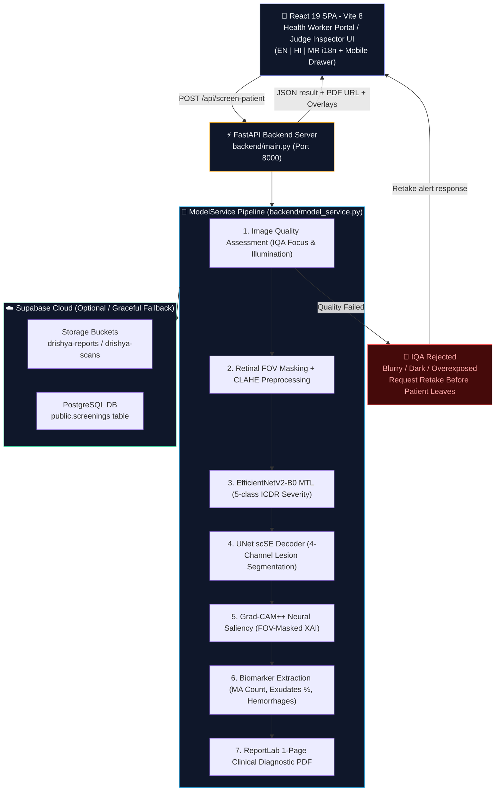

# 🩺 DRISHYA — AI-Powered Diabetic Retinopathy Screening

<div align="center">

> **दृष्टि** *(Drishya)* — Sanskrit for "Vision"

**A full-stack, edge-ready clinical AI screening platform for rural diabetic retinopathy (DR) triage.**  
Engineered for deployment in Primary Health Centres (PHCs), sub-centres, and low-resource tele-ophthalmology hubs where retinal specialists are unavailable.

<br/>

[](https://python.org)
[](https://pytorch.org)
[](https://fastapi.tiangolo.com)
[](https://react.dev)
[](https://vitejs.dev)
[](https://opencv.org)
[](https://supabase.com)
[](#-multilingual-support-en--hi--mr)
[](#key-features)

</div>

---

## 📋 Table of Contents

- [Overview](#overview)
- [Key Features](#key-features)
- [System Architecture](#system-architecture)
- [AI Model Architecture](#ai-model-architecture)
- [Multilingual Support (EN | HI | MR)](#-multilingual-support-en--hi--mr)
- [Mobile & Tablet Responsiveness](#-mobile--tablet-responsiveness)
- [Pipeline Stages](#pipeline-stages)
- [Tech Stack](#tech-stack)
- [Project Structure](#project-structure)
- [Setup & Installation](#setup--installation)
- [Running the Application](#running-the-application)
- [API Reference](#api-reference)
- [UI Modes](#ui-modes)
- [Database Schema](#database-schema)
- [Configuration](#configuration)
- [Training Datasets](#training-datasets)
- [License](#license)

---

## Overview

DRISHYA is an end-to-end clinical screening system that takes a **retinal fundus photograph** as input and outputs:

- 🎯 **ICDR DR Grade** (0–4, 5-class international classification)
- 🚨 **Referable DR Decision** (Grade ≥ 2 → immediate referral to ophthalmologist)
- 🔍 **Image Quality Assessment (IQA)** score with reject/enhance/accept decision
- 🔬 **4-Channel Lesion Segmentation Masks** for Microaneurysms, Exudates, Hemorrhages, and Sub-retinal Exudates
- 🌡️ **Grad-CAM++ Explainability Heatmaps** overlaid on the fundus image with FOV masking
- 📄 **Audit-Ready 1-Page Clinical PDF Report** synced to cloud or served locally
- 🌐 **Tri-Lingual Interface** in English, Hindi, and Marathi with 0 ms switching

> [!NOTE]
> Designed for **frontline ASHA workers and PHC nurses** with zero ophthalmology training — simply register a patient, upload or capture a fundus photo, and receive clinical-grade decision support in under 3 seconds.

---

## Key Features

| Feature | Detail |
|:---|:---|
| 🧠 **Multi-Task AI** | Simultaneous DR grading + 4-channel lesion segmentation in a single forward pass (~7.67M params) |
| 🌐 **Tri-Lingual (i18n)** | Curated medical terminology in **English**, **Hindi (हिन्दी)**, and **Marathi (मराठी)** with offline 100% parity |
| 📱 **Mobile & Tablet Ready** | Responsive slide-over hamburger drawer for `< 1000px`, phone-optimized single-column forms for `< 640px` |
| 🔍 **Image Quality Gate** | MATLAB + Python dual IQA rejects/enhances blurry or underexposed scans before inference |
| 🌡️ **Grad-CAM++ XAI** | Retinal-FOV-masked neural activation maps proving classifier attention aligns with verified lesions |
| 📄 **Clinical PDF Report** | IDx-DR styled 1-page report with quantified biomarkers, heatmaps, and doctor referral guidelines |
| ☁️ **Supabase Cloud Sync** | Auto-uploads diagnostic PDFs to `drishya-reports` and scan overlays to `drishya-scans` |
| 🖥️ **Single-Port Serving** | FastAPI serves both the production REST API and compiled React SPA from port `8000` |
| 👩‍⚕️ **Dual Portal Modes** | **Health Worker Portal** (fast screening) + **Judge Inspector** (explainability & tensor debug) |
| 🔌 **100% Offline Edge Fallback** | Works completely offline in rural PHCs without internet or Supabase connectivity |

---

## System Architecture



---

## AI Model Architecture

### EfficientNetV2-B0 Multi-Task Student Model (`DRISHYAEfficientNetV2MTL`)

The core AI model is a **lightweight multi-task student model** distilled specifically for edge and rural tele-ophthalmology hardware:

| Property | Value | Description |
|:---|:---|:---|
| **Backbone** | `tf_efficientnetv2_b0` | Fused-MBConv stages from `timm` |
| **Parameters** | **~7.67M** | Extremely compact and fast on CPU or mobile edge GPU |
| **Classification Head** | 5-class ICDR | DR severity grading (Grades 0 to 4) |
| **Segmentation Head** | 4-channel pixel masks | Identifies Microaneurysms, Exudates, Hemorrhages, Soft Exudates |
| **Attention Mechanism** | **scSE** | Spatial and Channel Squeeze & Excitation in UNet decoder |
| **Feature Gating** | **MSAG** | Multi-Scale Attention Gate for fine-grained lesion localization |
| **Explainability** | Grad-CAM++ | Neural gradient saliency with retinal FOV masking |
| **Checkpoint** | `models/student_mtl_lcnet_best.pth` | Unified PyTorch multi-task weights |

#### ICDR Grade Severity & Triage Protocol

| Grade | Label | Description | Clinical Triage Action |
|:---:|:---|:---|:---|
| **0** | **No DR** | Clear retina, no microvascular lesions | Routine annual rescreening (12 months) |
| **1** | **Mild NPDR** | Microaneurysms only | Monitor and routine re-exam (6–12 months) |
| **2** | **Moderate NPDR** | More than microaneurysms, exudates or blot hemorrhages | **Refer to Ophthalmologist within 2–4 weeks** |
| **3** | **Severe NPDR** | 4 quadrants of hemorrhages or venous beading | **Urgent referral to specialist within 1 week** |
| **4** | **Proliferative DR (PDR)** | Neovascularization of disc/retina, vitreous bleed | **Emergency referral — same week treatment** |

#### Lesion Segmentation Channels

| Channel | Lesion Type | Clinical Significance | Color Tag |
|:---:|:---|:---|:---:|
| **0** | **Microaneurysms (MA)** | Earliest identifiable sign of retinal microvascular damage | 🔴 Red |
| **1** | **Hard Exudates (EX)** | Lipid/lipoprotein leakage from damaged capillaries | 🟡 Yellow |
| **2** | **Hemorrhages (HE)** | Intraretinal bleeding from ruptured microaneurysms | 🩸 Crimson |
| **3** | **Soft Exudates (SE)** | Cotton-wool spots representing focal nerve fiber infarcts | ⚪ Off-white |

---

## 🌐 Multilingual Support (EN | HI | MR)

DRISHYA features a **zero-dependency, offline-ready internationalization engine** designed for Indian rural healthcare:

<div align="center">

| Language | Native Name | Script | Healthcare Regional Focus |
|:---:|:---:|:---:|:---|
| **English** | English | Latin | Medical Officers, Telemedicine Specialists, Audit Records |
| **Hindi** | **हिन्दी** | Devanagari | Northern & Central India PHC Staff, ASHA Workers |
| **Marathi** | **मराठी** | Devanagari | Maharashtra State Health Services, Rural Sub-centres |

</div>

### Key i18n Capabilities:
- **100% Dictionary Parity**: All 122 clinical labels, IQA status alerts, triage verdicts, and biomarker metrics are translated and verified.
- **Zero Latency (0 ms)**: Language switching occurs instantaneously on the client side without network requests or external translation APIs.
- **Persistent Preference**: Remembers the selected language across browser sessions via `localStorage` (`drishya_lang`).
- **Devanagari Font Stack**: Bundled with font fallbacks (`Noto Sans Devanagari`, `Inter`) for clean, legible ligatures on mobile screens.

---

## 📱 Mobile & Tablet Responsiveness

Engineered with a **mobile-first clinical workflow** for health workers conducting field screenings using smartphones or tablets:

```
📱 Screen Width < 1000px                    📲 Screen Width < 640px (Phones)
┌──────────────────────────────────────┐     ┌────────────────────────┐
│ [☰] DRISHYA       [EN | HI | MR]    │     │ [☰] DRISHYA   [EN|HI|MR]│
├──────────────────────────────────────┤     ├────────────────────────┤
│ ┌──────────────────────────────────┐ │     │ 1. Patient Registration│
│ │ 1. Patient Registration          │ │     │ [Full Name            ]│
│ │ [Name          ] [Phone        ] │ │     │ [Phone Number         ]│
│ └──────────────────────────────────┘ │     │ [Age] [Gender] [ABHA  ]│
│                                      │     │ 2. Retinal Ingestion   │
│ ┌──────────────────────────────────┐ │     │ [ 📷 Touch to Capture ]│
│ │ 2. Retinal Photo Ingestion       │ │     │ 3. Clinical Action     │
│ │ [ Drag & Drop / Tap to Capture ] │ │     │ [ Preview Report      ]│
│ └──────────────────────────────────┘ │     │ [ Download PDF        ]│
└──────────────────────────────────────┘     └────────────────────────┘
```

1. **Slide-Over Hamburger Drawer**: On screens `< 1000px`, the desktop sidebar transitions into a slide-over drawer with backdrop blur and one-tap close (`X`).
2. **Context-Aware Mode Auto-Switching**: The complex research "Judge Inspector" mode automatically hides on mobile devices, keeping field workers focused strictly on patient screening.
3. **Fluid Grid Collapse**: Forms seamlessly adapt from multi-column desktop tables into single-column, thumb-accessible mobile inputs.
4. **Adaptive Modals**: Report previews dynamically adjust margins and padding to fit comfortably within mobile viewports.

---

## Pipeline Stages

DRISHYA operates as a unified, multi-stage clinical pipeline:

### Stage 1 — Pre-Processing & Quality Control (`pre_processing_pipeline/`)

> Implemented in **MATLAB** for signal-processing-grade image evaluation.

1. **Retinal Mask Extraction** (`extract_retinal_mask.m`) — Crops fundus images to the circular retinal FOV and removes non-retinal black camera margins.
2. **Image Quality Assessment** (`assess_quality.m`, `evaluate_iqa.m`) — Computes focus sharpness ($F$), contrast ($C$), and a composite quality score ($Q$).
3. **Three-Tier IQA Decision Engine**:
   - $Q < 0.76$ → **UNGRADABLE** — Reject scan and prompt health worker for immediate retake.
   - $0.76 \le Q < 0.78$ → **BORDERLINE** — Apply adaptive CLAHE enhancement.
   - $Q \ge 0.78$ → **ACCEPTABLE** — Validated scan; proceed to inference.
4. **Adaptive Enhancement** (`adaptive_enhance.m`) — Applies CLAHE and Ben Graham local Gaussian background subtraction.

*Entry point:* `pre_processing_pipeline/run_iqa_enhancement_pipeline.m`

---

### Stage 2 — Lesion Feature Pipeline (`pipeline_stage2/`)

> Training-time and validation pipeline combining **Python + MATLAB** across 5 international fundus datasets:
> **APTOS 2019, DRIVE, EyePACS, IDRiD, and MESSIDOR-2**.

- **Optic Disc & Macula Localization** (`extract_landmarks.m`)
- **Vessel Segmentation** via Frangi multi-scale filter (`extract_vessels.m`)
- **Hemorrhage Classification** across retinal quadrants (`classify_hemorrhages.m`)
- **Lesion Detection & Mask Generation** (`detect_lesions.m`)
- **Multicore Parallel Batch Processing** (`run_stage2_multicore.py`)
- **Mask Integrity Verification** (`verify_masks.py`)

*Entry point:* `pipeline_stage2/run_stage2_master.py`

---

### Stage 3 — Real-Time Clinical Inference (`backend/model_service.py`)

> Real-time inference executing on **CPU or CUDA GPU** upon patient photo upload.

1. **Retinal FOV Masking**: `create_fundus_fov_mask` isolates true retinal tissue.
2. **Real-time Laplacian IQA**: Evaluates focus variance and illumination to catch blurry captures instantly.
3. **Normalization**: Resizes to $384 \times 384$ tensor, applying CLAHE and Ben Graham filtering.
4. **EfficientNetV2 MTL Forward Pass**: Computes DR classification logits + 4-channel lesion segmentation masks simultaneously.
5. **Grad-CAM++ Explainability**: Calculates second-order gradients on final convolutional feature maps with FOV masking.
6. **Biomarker Quantification**: Calculates microaneurysm count, exudate area %, and hemorrhage spread.
7. **ReportLab PDF Generation**: Synthesizes a standardized, audit-ready 1-page clinical diagnostic PDF report.
8. **Cloud & Storage Sync**: Uploads PDF report and diagnostic overlays to Supabase (or falls back to local storage).

---

## Tech Stack

<div align="center">

### Backend & AI Runtime
| Component | Technology | Badge |
|:---|:---|:---:|
| **API Framework** | FastAPI 0.115+ |  |
| **Model Runtime** | PyTorch 2.x |  |
| **Neural Backbone** | `timm` (EfficientNetV2-B0) |  |
| **Segmentation** | `segmentation-models-pytorch` |  |
| **Explainability** | Grad-CAM++ (Custom FOV Masked) |  |
| **Computer Vision** | OpenCV & Albumentations |  |
| **PDF Generation** | ReportLab 4.x |  |
| **Cloud DB & Storage** | Supabase (PostgreSQL) |  |
| **ASGI Server** | Uvicorn |  |

### Frontend & Client UI
| Component | Technology | Badge |
|:---|:---|:---:|
| **UI Library** | React 19 (Hooks & Context) |  |
| **Build Tool** | Vite 8 (Ultra-fast HMR) |  |
| **Icons** | Lucide React |  |
| **Code Quality** | Oxlint (Rust-based linter) |  |
| **Styling** | Vanilla CSS Design System |  |
| **i18n Engine** | Custom Context (EN \| HI \| MR) |  |

</div>

---

## Project Structure

```
drishya/
│
├── backend/                                # FastAPI backend service
│   ├── main.py                             # API entrypoint, routes, and SPA server
│   ├── model_service.py                    # Clinical screening inference engine
│   ├── model_student.py                    # EfficientNetV2-B0 MTL architecture
│   ├── database.py                         # Supabase DB and storage integration
│   ├── config.py                           # Configuration and environment loader
│   ├── schema.sql                          # Supabase PostgreSQL schema
│   ├── .env                                # Local environment secrets (git-ignored)
│   └── .env.example                        # Template for environment variables
│
├── ui/                                     # React 19 + Vite 8 frontend
│   ├── src/
│   │   ├── App.jsx                         # Main app shell, drawer state, and routing
│   │   ├── main.jsx                        # React root entrypoint
│   │   ├── index.css                       # Design tokens, themes, and mobile queries
│   │   │
│   │   ├── context/                        # State management & i18n
│   │   │   ├── LanguageContext.jsx         # Language provider with localStorage sync
│   │   │   ├── languageContextInstance.js  # React Context instance
│   │   │   └── useLanguage.js              # useLanguage hook
│   │   │
│   │   ├── i18n/                           # Multilingual dictionaries
│   │   │   └── translations.js             # English, Hindi, and Marathi translations
│   │   │
│   │   └── components/
│   │       ├── HealthWorkerMode.jsx        # Patient intake and screening UI
│   │       ├── JudgeInspectorMode.jsx      # Pipeline explainability & tensor viewer
│   │       ├── LanguageSelector.jsx        # Top-bar language switcher capsule
│   │       ├── PdfPreviewModal.jsx         # In-app diagnostic PDF report preview
│   │       └── Sidebar.jsx                 # Responsive sidebar & mobile drawer
│   │
│   ├── public/                             # Static logos, icons, and sample scans
│   ├── report_generator.py                 # ReportLab clinical PDF generator
│   ├── package.json                        # Node dependencies and scripts
│   └── vite.config.js                      # Vite build configuration
│
├── pre_processing_pipeline/                # MATLAB + Python IQA pipeline
│   ├── run_iqa_enhancement_pipeline.m      # Master IQA pipeline
│   ├── extract_retinal_mask.m              # Circular retinal FOV crop
│   ├── assess_quality.m                    # Sharpness and contrast metrics
│   ├── evaluate_iqa.m                      # Q-score decision thresholds
│   └── adaptive_enhance.m                  # CLAHE enhancement script
│
├── pipeline_stage2/                        # Lesion feature extraction pipeline
│   ├── run_stage2_master.py                # Single-core master runner
│   ├── run_stage2_multicore.py             # Multiprocessing batch runner
│   ├── extract_landmarks.m                 # Optic disc and fovea localization
│   ├── extract_vessels.m                   # Frangi vessel filter
│   ├── detect_lesions.m                    # Lesion segmentation routines
│   └── classify_hemorrhages.m              # Quadrant hemorrhage classifier
│
├── models/                                 # Trained model weights directory
│   └── student_mtl_lcnet_best.pth          # EfficientNetV2 MTL weights (~30MB)
│
├── requirements.txt                        # Python dependencies
├── start.sh                                # Unified startup script
└── README.md                               # Project documentation
```

---

## Setup & Installation

### Prerequisites

- **Python**: `3.10` or newer
- **Node.js**: `18.x` or newer (with `npm`)
- **MATLAB**: `R2021b+` *(optional; only needed if running offline Stage 1 & 2 batch preparation)*
- **Hardware**: CPU supported; NVIDIA GPU recommended for sub-second inference

### 1. Clone the Repository

```bash
git clone https://github.com/amanvaibhav162/drishya.git
cd drishya
```

### 2. Set Up Python Environment

```bash
python -m venv .venv
source .venv/bin/activate        # On Linux/macOS
# .venv\Scripts\activate         # On Windows

pip install -r requirements.txt
```

### 3. Install Frontend Dependencies

```bash
cd ui
npm install
cd ..
```

### 4. Configure Environment Secrets

```bash
cp backend/.env.example backend/.env
```

Edit `backend/.env` with your settings:

```env
SUPABASE_URL=https://your-project.supabase.co
SUPABASE_KEY=your-supabase-anon-key
MODEL_PATH=models/student_mtl_lcnet_best.pth
PORT=8000
STORAGE_BUCKET_REPORTS=drishya-reports
STORAGE_BUCKET_IMAGES=drishya-scans
```

> [!TIP]
> **No Supabase Account?** Leave `SUPABASE_URL` and `SUPABASE_KEY` empty. DRISHYA automatically runs in **local fallback mode** — all diagnostic images and PDF reports are stored and served locally from `backend/outputs/`.

### 5. Verify Model Checkpoint

Ensure the trained weights file is in the `models/` directory:

```bash
ls -lh models/student_mtl_lcnet_best.pth
```

---

## Running the Application

### Option A — One-Command Startup (Recommended)

```bash
chmod +x start.sh
./start.sh
```

This automated script will:
1. Activate `.venv`
2. Verify the model weights file
3. Build the React UI bundle (`npm run build`)
4. Launch the unified FastAPI server on port `8000`

Access the portal at: **http://localhost:8000**

---

### Option B — Development Mode (Hot Reload)

Run backend and frontend concurrently in two terminals:

**Terminal 1 — FastAPI Backend:**
```bash
source .venv/bin/activate
uvicorn backend.main:app --host 0.0.0.0 --port 8000 --reload
```

**Terminal 2 — Vite Dev Server:**
```bash
cd ui
npm run dev
```

Open your browser at: **http://localhost:5173** *(with instant Hot Module Replacement)*

---

## API Reference

Interactive Swagger documentation is available at: **http://localhost:8000/docs**

### `GET /api/health`
Check service health and active inference device.

```json
{
  "status": "healthy",
  "service": "DRISHYA AI Engine",
  "device": "cuda:0"
}
```

---

### `POST /api/screen-patient`
Run the full clinical screening pipeline on an uploaded fundus scan.

**Request:** `multipart/form-data`

| Parameter | Type | Required | Description |
|:---|:---|:---:|:---|
| `file` | Binary Image | **Yes** | Retinal fundus scan (JPG, PNG, or TIFF) |
| `name` | String | No | Patient name (default: *"Anonymous Patient"*) |
| `age` | String | No | Patient age |
| `gender` | String | No | Patient gender (*Male*, *Female*, *Other*) |
| `phone` | String | No | Contact telephone number |
| `abha_id` | String | No | Ayushman Bharat Health Account ID |

**Response (Success):**
```json
{
  "success": true,
  "iqa_pass": true,
  "q_score": 0.84,
  "grade": 2,
  "grade_title": "Moderate NPDR",
  "confidence": "94.2%",
  "referable_dr": true,
  "action": "Refer to Ophthalmologist within 2-4 weeks",
  "biomarkers": {
    "microaneurysms": 8,
    "exudate_area_pct": "1.42%",
    "hemorrhage_quadrants": 1,
    "macular_risk": "Low Risk (Fovea Clear)"
  },
  "files": {
    "raw_path": "backend/outputs/raw_20260904_120000.png",
    "preprocessed_path": "backend/outputs/preprocessed_20260904_120000.png",
    "lesion_path": "backend/outputs/lesion_20260904_120000.png",
    "heatmap_path": "backend/outputs/heatmap_20260904_120000.png",
    "gradcam_path": "backend/outputs/gradcam_20260904_120000.png",
    "pdf_report_path": "backend/outputs/report_20260904_120000.pdf"
  },
  "supabase_synced": true,
  "pdf_download_url": "/api/download-report/report_20260904_120000.pdf"
}
```

---

## UI Modes

### 1. Health Worker Portal
The primary interface for community health workers and nurses:
- **Patient Intake**: Quick data entry with ABHA ID formatting.
- **Fundus Scope Ingestion**: Drag & drop or direct live scope capture.
- **5-Stage Animated Progress Bar**: Real-time progress indicators (*IQA → Preprocessing → Inference → Saliency → Report Compilation*).
- **Triage Decision Badge**: High-contrast color-coded indicators (**🟢 NO REFERRAL** vs **⚠️ REFERRAL NEEDED**).
- **1-Tap PDF Preview & Print**: Instant preview of the diagnostic report.

### 2. Judge Inspector Mode (Desktop Only)
A dedicated explainability interface for clinical researchers and audit teams:
- **4-Way Layer Inspection**: Toggle between *(a) Raw Scan*, *(b) CLAHE Preprocessed*, *(c) Lesion Contours*, and *(d) Grad-CAM++ Attention*.
- **Interactive Saliency Slider**: Adjust neural heatmap opacity from 0% to 100% in real-time.
- **Biomarker Evidence Table**: Quantitative metrics on microaneurysms, exudate percentage, and hemorrhage quadrants.
- **Pipeline Stepper Debugger**: Trace intermediate tensor shapes and pipeline step outputs.

---

## Database Schema

Screening records are stored in the Supabase PostgreSQL `screenings` table ([backend/schema.sql](backend/schema.sql)):

| Column | Type | Description |
|:---|:---|:---|
| `id` | `UUID` | Primary key (`gen_random_uuid()`) |
| `created_at` | `TIMESTAMP` | Timestamp of screening event |
| `patient_name` | `TEXT` | Patient full name |
| `patient_age` | `TEXT` | Patient age |
| `patient_gender` | `TEXT` | Patient gender |
| `patient_phone` | `TEXT` | Contact number |
| `abha_id` | `TEXT` | ABHA Health ID |
| `icdr_grade` | `INTEGER` | ICDR DR Grade (0 to 4) |
| `grade_title` | `TEXT` | Severity classification text |
| `confidence` | `TEXT` | AI model confidence score |
| `referable_dr` | `BOOLEAN` | Triage referral flag (`true` if Grade ≥ 2) |
| `iqa_score` | `REAL` | Quality assessment score |
| `num_microaneurysms` | `INTEGER` | Total segmented microaneurysms |
| `exudate_area_pct` | `TEXT` | Percentage of retinal area covered by exudates |
| `pdf_report_url` | `TEXT` | Supabase storage link to compiled PDF |
| `gradcam_image_url` | `TEXT` | Supabase storage link to XAI heatmap |

---

## Configuration

All configurable parameters are centralized in `backend/.env`:

| Parameter | Default | Description |
|:---|:---|:---|
| `SUPABASE_URL` | `""` | Supabase project API URL |
| `SUPABASE_KEY` | `""` | Supabase anon public API key |
| `MODEL_PATH` | `models/student_mtl_lcnet_best.pth` | Filepath to PyTorch model weights |
| `PORT` | `8000` | FastAPI server HTTP listening port |
| `STORAGE_BUCKET_REPORTS` | `drishya-reports` | Supabase bucket for clinical PDFs |
| `STORAGE_BUCKET_IMAGES` | `drishya-scans` | Supabase bucket for diagnostic scans |

---

## Training Datasets

The DRISHYA pipeline was developed and validated using the following landmark retinal datasets:

| Dataset | Modality | Annotations | Primary Clinical Focus |
|:---|:---|:---|:---|
| **APTOS 2019** | Color Fundus | 5-Class ICDR DR Grades | Real-world Indian clinical variability |
| **IDRiD** | High-Res Fundus | Pixel-level Lesion Masks (MA, EX, HE, SE) | Deep multi-task lesion segmentation |
| **EyePACS** | Color Fundus | DR Grades (0–4) | Large-scale feature representation |
| **DRIVE** | Fundus Photography | Vessel Segmentations | Vascular segmentation & landmark isolation |
| **MESSIDOR-2** | Multi-Center Fundus | DR Grade & Macular Edema Risk | Generalization across clinical centers |

---

## License

This project is licensed for academic, educational, and non-commercial research use. Checkpoints, datasets, and pretrained model backbones are subject to their respective upstream licenses.

---

<div align="center">

**Built for rural healthcare. Powered by artificial intelligence. Designed to save vision.**  
*दृष्य — दृष्टि बचाओ, जीवन बचाओ*

</div>
